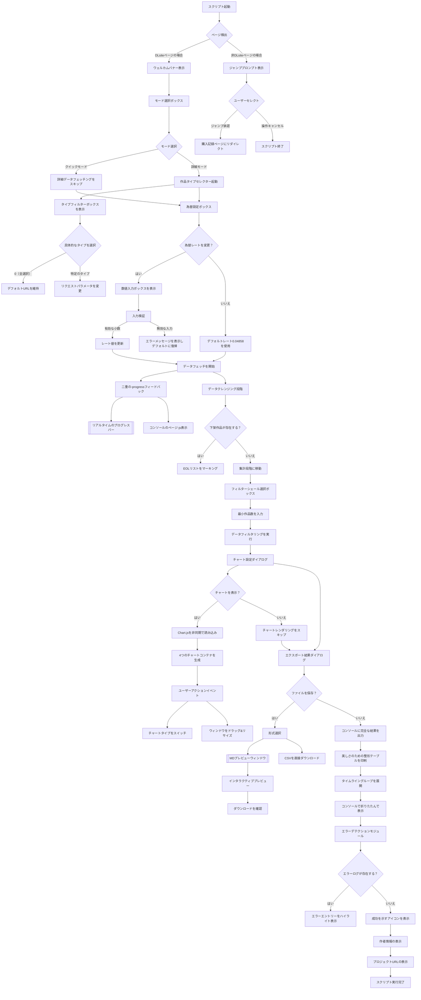
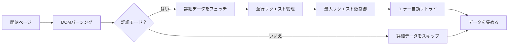
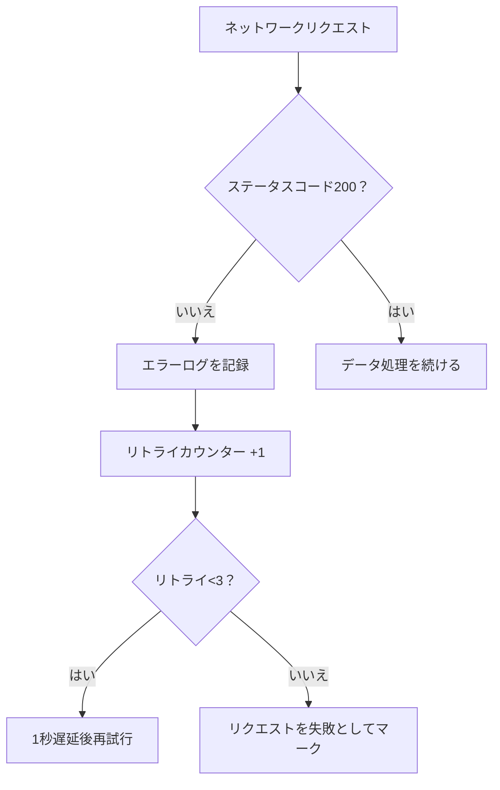
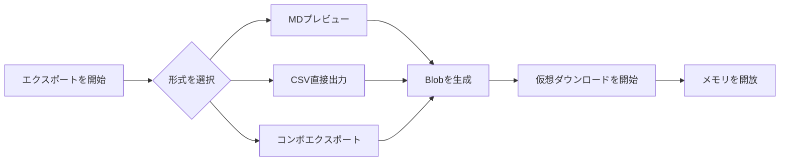
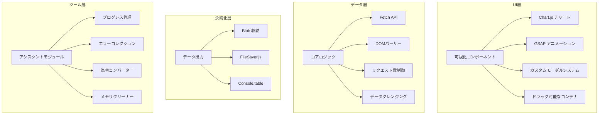
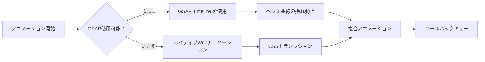

# DLsite 購入分析ツール v2.0

📈 ユーザー行動に基づくDLsite購入記録の深度分析ツール、可視化チャート、インタラクティブなポップアップ、スマートなデータエクスポートをサポート

---

## 🚀 核心アップグレードポイント

- **全新可視化システム**：Chart.js の動的チャートを統合
- **インタラクティブエクスペリエンスの強化**：標準ダイアログに代わる完全カスタムのモーダルウィンドウ
- **スマートなエラーハンドリング**：リアルタイムエラーログ記録と自動リトライメカニズム

---

## 🌟 機能特性

### 🖥️ インタラクションシステム

- 動的ポップアップシステム（選択/確認/入力をサポート）
- ドラッグ&リサイズ可能なチャートウィンドウ
- GSAP アニメーショントランジション効果
- リアルタイムのプログレスバーフィードバック（コンソールとページでダブルディスプレイ）

### 📊 データ分析

- **4次元チャートシステム**：
  - タイプ/クリエイターグループ統計チャート（マシンクロスイッチ可能な棒グラフ↔円グラフ）
  - 毎日の購入傾向折れ線図
  - 累積消費金額曲線
  - 具体的なアイコンをクリックして詳細な作品情報を表示可能
- スマートなフィルターシステム（最小作品数で次要なデータをフィルター）
- 為替換算システム（リアルタイムの為替レート変更をサポート）

### 🛡️ 拡張機能

- 自動ページ検出とスマートなジャンプ
- 下架作品個別マーキングシステム
- データサンドボックスモード（統計スピード300%向上）
- クラッシュリカバリー機構（`window.reloadData` グローバルコマンド）

### 📦 エクスポートシステム

- 多形式エクスポートサポート（MDプレビュー/CSV/コンソールテーブル）
- モバイルデバイスの自適応表示
- エラーログトレースバック機能

---

## 🛠️ 使用ガイド

### 環境準備

```javascript
// 最新のブラウザ要件
Chrome 89+ / Firefox 86+ / Edge 91+
```

### クリックする前に

1. [DLsite購入記録ページ](https://www.dlsite.com/maniax/mypage/userbuy) にログインする
2. 開発者ツールを開く（F12）
3. コンソールパネルに完全なコードを貼り付けよう

## 🔄 インタラクションフロー詳細



### キーインタラクションポイントの解説

#### 1. 動的ポップアップシステム

- **3レイヤモーダル構造**：
  - ベースレイヤ：半透明の背景（`.modal-overlay`）
  - コンテンツレイヤ：自適応コンテナ（`.modal-container`）
  - オペレーションレイヤ：ボタングループ（`.btn` クラスター）
- **スマートフォーカス**：最後のポップアップは常に最高のz-indexを持つ

#### 2. チャートインタラクション

- **インスタントリロード**：切り替えボタンをクリックすると古いChartインスタンスを破棄し再構築
- **メモリ機能**：各チャートの表示状態（棒グラフ/円グラフ）をグローバル変数に独立記憶
- **レスポンシブデザイン**：
  
  ```javascript
  // ウィンドウリサイズイベントリスナー
  container.style.resize = "both";
  // キャンバスサイズを自動調整
  canvas.style.width = "100%";
  canvas.style.height = "calc(100% - 30px)";
  ```

#### 3. データフェッチングフロー



#### 4. 例外ハンドリングパス



#### 5. ファイルエクスポートフロー



---

## ⚙️ パラメータ設定

### モード選択

| オプション   | 機能説明                          |
| ------- | ----------------------------- |
| クイックモード | 基本的な消費データのみを統計（詳細データをフェッチしない） |
| 詳細モード   | 完全なラベル分析+メインタイプ統計             |

### アドバンスト設定

```markdown
1. 為替校正：デフォルト 1CNY=0.04858JPY、小数点以下6桁までサポート
2. フィルターシェール：数字Nを入力すると作品数<Nの分類を自動的にフィルター
3. チャート設定：各チャートの表示状態（棒グラフ/円グラフ）を独立的に記憶
```

---

## 📊 出力例

### コンソール出力

```markdown
✦ DLsite購入履歴統計 ✦
購入作品総数：189 本
累積消費金額：¥82,450 JPY（≈¥3,987.51 CNY）

★ タイプ別統計 ★
同人音声    | ██████████ 58
成人向けゲーム  | ███████ 37
マンガ合集    | █████ 25

★ チャートシステム ★
[動的ウィンドウ1] タイプ分布（棒グラフ）
[動的ウィンドウ2] クリエイターグループランキング（円グラフ）
[動的ウィンドウ3] 消費傾向折れ線図
```

### ファイルエクスポート

```markdown
# DLsite購入履歴調査報告書

## 消費トレンド分析


## 異常記録
| 日付       | 作品名         | 状態   |
|------------|------------------|--------|
| 2025/03/05 | [下架済み]作品X    | 404    |
```

---

## ⚠️ 注意事項

### 性能最適化

```markdown
1. デスクトップ環境での実行を推奨（モバイルは自動で表示を適応させるが機能が制限される）
2. 100+作品の場合にはクイックモードを有効化を推奨
3. `window.clearLogs` を使用してメモリをクリア
```

### エラー処理

```markdown
ネットワークエラーが発生した場合：
1. 自動で3回リトライ
2. エラーログは errorLogs 配列に保存
3. reloadData コマンドで-sessionを復元可能
```

---

## 🏗️ 技術構造詳細

### システムレイヤ構造



### キーテクノロジースタック

#### コア依存ライブラリ

| ライブラリ/技術      | バージョン  | 用途          | 関键な実装                                 |
| ------------- | ------ | ----------- | ------------------------------------- |
| **Chart.js**  | 4.4.0  | データ可視化      | `drawGenreChart()` `drawMakerChart()` |
| **GSAP**      | 3.12.0 | アニメーションエンジン | `animateModalIn()` `fadeOut()`        |
| **DOMParser** | ネイティブ  | DOMパーサー     | `processPage()` データ抽出                 |
| **FileSaver** | 2.0.5  | ファイルを保存     | `exportCSV()` ダウンロード実装                |

#### ネイティブ技術適用事例

```markdown
1. **WebアニメーションAPI**  
   - プログレスバーの動的効果を実装
   - コンソールのProgボタンのプログレスアニメーション（ASCII文字で）

2. **CSSグリッド/フレックス**  
   - レスポンシブチャートコンテナレイアウト
   - モーダルウィンドウの自適応レイアウト

3. **ResizeObserver**  
   - チャートウィンドウのリサイズイベントを監視
   - 動的にCanvasキャンバスのサイズを調整

4. **Proxy API**  
   - グローバルステート管理（エラーログ/チャート状態）
```

### キーモジュール実装

#### 1. 並行制御システム

```javascript
// 最大並行数制御
const MAX_CONCURRENT = 5;
let activePromises = 0;

async function controlledFetch(url) {
  while (activePromises >= MAX_CONCURRENT) {
    await new Promise(resolve => setTimeout(resolve, 500));
  }
  activePromises++;
  try {
    return await fetch(url);
  } finally {
    activePromises--;
  }
}
```

#### 2. メモリ管理メカニズム

```javascript
// スマートクリーニング戦略
const memoryWatcher = {
  threshold: 0.8, // メモリ使用率の閾値
  cleanup() {
    if (performance.memory.usedJSHeapSize / 
        performance.memory.jsHeapSizeLimit > this.threshold) {
      this.forceCleanup();
    }
  },
  forceCleanup() {
    genreChartObj?.destroy();
    makerChartObj?.destroy();
    URL.revokeObjectURL(blobCache);
  }
};

// 60秒ごとに检测実行
setInterval(() => memoryWatcher.cleanup(), 60000);
```

#### 3. アニメーションシステムアーキテクチャー



### 性能最適化戦略

#### データフェッチング最適화

```markdown
1. **ページプレロード**  
   - `Promise.allSettled()` を使用してページを一括りクエストし、ネットワーク遅延に応じて動的にリクエスト数を調整

2. **DOMキャッシュ**  
   - 解析済みのドキュメントオブジェクトを再利用し、セレクタ結果をキャッシュポールで格納

3. **基増分渲染**  
   - DOMノードをバッチ処理し、毎回50msで10個のノードを処理
```

#### チャート最適化

```javascript
// Canvas 描画の最適化
Chart.defaults.animation = false; // デフォルトアニメーションを無効化
Chart.defaults.datasets.bar.barThickness = 25; // 条形の幅を固定
Chart.defaults.elements.point.radius = 3; // データポイントを最適化

// チャートの再描画をコントロールする
functiondebouncedRedraw() {
  let isRendering = false;
  return () => {
    if (!isRendering) {
      requestAnimationFrame(() => {
        genreChartObj?.update();
        makerChartObj?.update();
        isRendering = false;
      });
      isRendering = true;
    }
  };
}
```

### 安全メカニズム

```markdown
1. **サンドボックスモード**  
   - `Proxy` を使用してグローバル変数をカプセル化し、メモリ操作権限を制限

2. **入力検証**  
   ```javascript
   // 為替入力検証
   const validateExchangeRate = (input) => {
     return /^0\.0\d{1,5}$/.test(input) && 
            parseFloat(input) > 0;
   };
```

3. **CORS処理**  
   - 動的に `no-cors` モードを追加し、失敗した要求は指数退避アルゴリズムでリトライ
     
     ```
     
     ```

---

> 📌 **アーキテクチャーデザインの原則**  
> 
> 1. モジュール化デザイン - 各機能モジュールの最大コード行数は200以内  
> 2. メモリの安全 - オブジェクト破棄後はGCを自動化  
> 3. 進化型強化 - コア機能は第三方ライブラリに依存しない  
> 4. レスポンシブファースト - 全コンポーネントはモバイル触控を支援  

```
---

## 📌 バージョン履歴

### v2.1 (2025/03/07)
- 新規の結果ウィンドウを追加。これでコンソールを見なくても良い

### v2.0 (2025/03/03)
- 新規4次元チャートシステムを追加
- インタラクションシステム全体をリファクタリング（alert/promptを廃止し、完全カスタムのモーダルウィンドウを実装）
- ウィンドウのドラッグ&リサイズ機能を追加
- モバイルデバイスの適応性を最適化
- データサンドボックスメモリ管理を実装
- GSAPアニメーションエンジンのサポートを追加
- エラーハンドリングシステムをアップグレード

### v1.2 (2025/02/24)
- CSVエクスポート機能を強化
- コンソール表示ロジックを最適化

---

## 📄 ライセンス
MIT License | 商業用途は禁止  
詳細な宣言はコードのヘッドコメントを参照

---

> 🌐 プロジェクトURL：https://github.com/linyaocrush/DLsite-Purchase-Analyzer  
> 📧 問題フィードバック：Issueを作成する時のコソコンのエラーショットを添付することを推奨  
```


