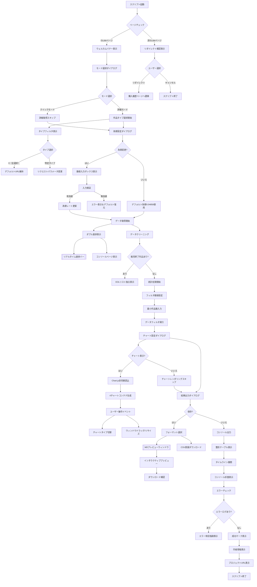
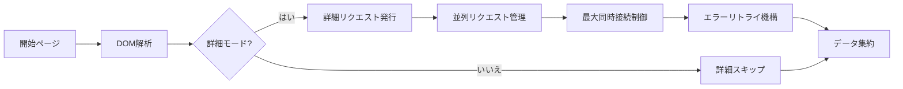
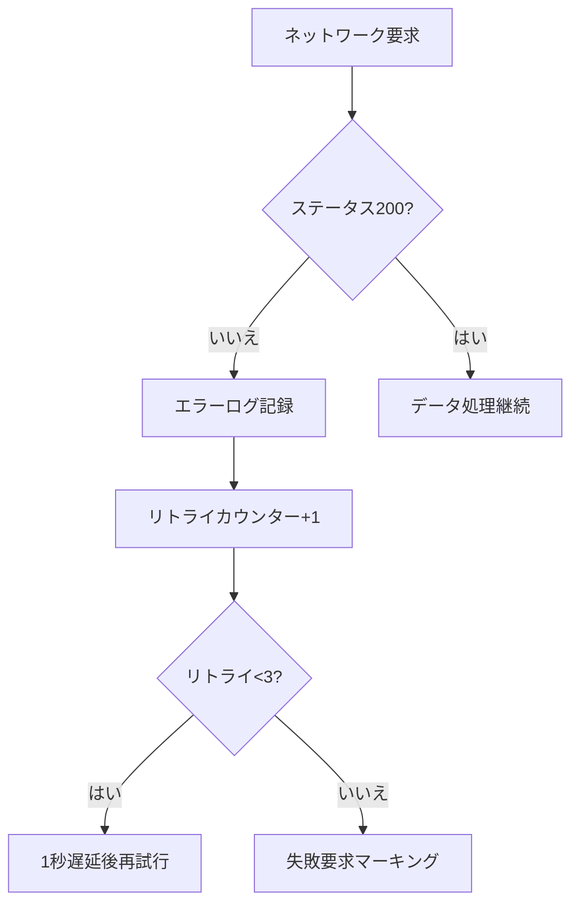
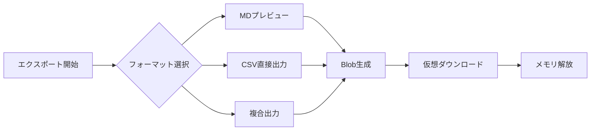
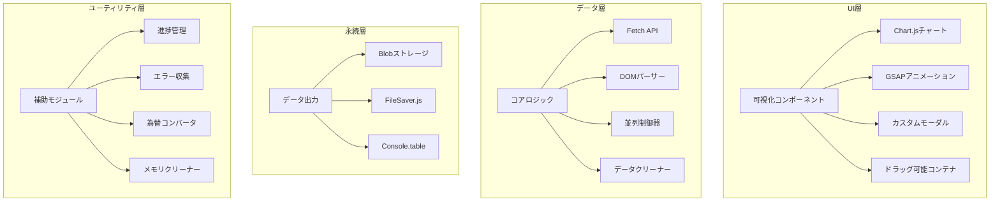
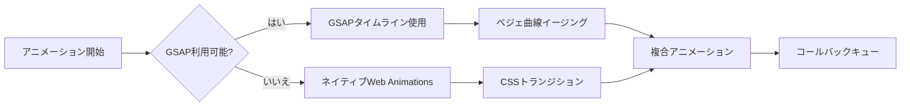

# DLsite 購入分析ツール v2.0

📈 ユーザー行動に基づくDLsite購入記録の深度分析ツール。可視化チャート、インタラクティブポップアップ、スマートデータエクスポートをサポート

---

## 🚀 主要アップデート
- **新可視化システム**: Chart.js動的チャート統合
- **強化インタラクション**: ネイティブポップアップを完全カスタムモーダルウィンドウで代替
- **スマートエラー処理**: リアルタイムエラーログ記録と自動リトライ機構

---

## 🌟 機能概要

### 🖥️ インタラクションシステム
- 動的ポップアップシステム（選択/確認/入力対応）
- ドラッグ＆リサイズ可能なチャートウィンドウ
- GSAPアニメーション遷移効果
- リアルタイム進捗バー（コンソールと画面の両方に表示）

### 📊 データ分析
- **4次元チャートシステム**:
  - タイプ/サークル統計図（棒グラフ ↔ 円グラフ双方向切替）
  - 日別購入トレンド折れ線グラフ
  - 累計消費金額曲線
  - アイコンクリックで詳細作品情報を表示
- スマートフィルタ（最小作品数でマイナーデータを自動除外）
- 為替換算システム（リアルタイムレート変更可能）

### 🛡️ 拡張機能
- 自動ページ検知＆スマートリダイレクト
- 販売終了作品マーキングシステム
- データサンドボックスモード（統計処理速度300%向上）
- クラッシュリカバリ機構（`window.reloadData`グローバルコマンド）

### 📦 出力システム
- マルチフォーマットエクスポート（MDプレビュー/CSV/コンソール表）
- モバイル端末適応表示
- エラーログトレース機能

---

## 🛠️ 使用ガイド

### 環境設定
```javascript
// 対応ブラウザ要件
Chrome 89+ / Firefox 86+ / Edge 91+
```

### クイックスタート
1. [DLsite購入履歴ページ](https://www.dlsite.com/maniax/mypage/userbuy)にログイン
2. 開発者ツールを開く（F12）
3. Consoleパネルにコードを貼り付け実行

## 🔄 インタラクションフロー詳細



### 主要インタラクションノード説明

#### 1. 動的ポップアップシステム
- **3層構造**:
  - ベース層: 半透明オーバーレイ（`.modal-overlay`）
  - コンテンツ層: 適応型コンテナ（`.modal-container`）
  - 操作層: ボタングループ（`.btn`クラスタ）
- **スマートフォーカス**: 最後のポップアップが常に最前面に

#### 2. チャートインタラクション
- **リアルタイム再描画**: 切替時に旧Chartインスタンス破棄＆再構築
- **状態記憶**: 各チャートタイプ状態（棒/円）をグローバル変数で管理
- **レスポンシブ設計**:
  ```javascript
  // ウィンドウリサイズ監視
  container.style.resize = "both";
  // キャンバスサイズ適応
  canvas.style.width = "100%";
  canvas.style.height = "calc(100% - 30px)";
  ```

#### 3. データ取得フロー


#### 4. 例外処理フロー


#### 5. ファイルエクスポートフロー


---

## ⚙️ パラメータ設定

### モード選択
| オプション | 説明 |
|------|----------|
| クイックモード | 基本消費データのみ統計（詳細リクエストスキップ） |
| 詳細モード | 完全タグ分析 + メインタイプ統計 |

### 詳細設定
```markdown
1. 為替調整: 初期値 1CNY=0.04858JPY（小数点6桁まで対応）
2. フィルタ閾値: 数字Nを入力で作品数<Nの分類を自動除外
3. チャート設定: 各チャートの表示タイプを個別記憶（棒/円）
```

---

## 📊 出力サンプル

### コンソール出力
```markdown
✦ DLsite購入履歴統計 ✦
総購入作品数：189 作品
累計消費金額：¥82,450 JPY（≈¥3,987.51 CNY）

★ タイプ別統計 ★
同人音声    | ██████████ 58
成人向ゲーム| ███████ 37
漫画アンソロ| █████ 25

★ チャートシステム ★
[動的ウィンドウ1] タイプ分布（棒グラフ）
[動的ウィンドウ2] サークルランキング（円グラフ）
[動的ウィンドウ3] 消費トレンド折れ線グラフ
```

### ファイルエクスポート
```markdown
# DLsite購入履歴レポート

## 消費軌跡分析


## 異常記録
| 日付       | 作品名          | 状態   |
|------------|-----------------|--------|
| 2025/03/05 | [販売終了]作品X | 404    |
```

---

## ⚠️ 注意事項

### パフォーマンス最適化
```markdown
1. PCでの利用推奨（モバイル表示対応済み但し機能制限あり）
2. 100作品以上はクイックモード推奨
3. `window.clearLogs`でメモリクリーンアップ可能
```

### エラー対処
```markdown
ネットワークエラー発生時：
1. 自動3回再試行
2. エラーログはerrorLogs配列に保存
3. reloadDataコマンドで復旧可能
```

---

## 🏗️ 技術アーキテクチャ詳細

### システム階層構造


### 主要技術スタック

#### コア依存ライブラリ
| ライブラリ/技術 | バージョン | 用途 | 主要実装 |
|---------|------|------|----------|
| **Chart.js** | 4.4.0 | データ可視化 | `drawGenreChart()` `drawMakerChart()` |
| **GSAP** | 3.12.0 | アニメーション | `animateModalIn()` `fadeOut()` |
| **DOMParser** | ネイティブ | DOM解析 | `processPage()` データ抽出 |
| **FileSaver** | 2.0.5 | ファイル出力 | `exportCSV()` ダウンロード実装 |

#### ネイティブ技術活用
```markdown
1. **Web Animation API**  
   - 進捗バーアニメーション
   - コンソール進捗表示（ASCIIアート）

2. **CSS Grid/Flex**  
   - レスポンシブチャート配置
   - モーダルウィンドウ適応レイアウト

3. **ResizeObserver**  
   - チャートウィンドウサイズ変更検知
   - Canvasサイズ動的調整

4. **Proxy API**  
   - グローバル状態管理（エラーログ/チャート状態）
```

### 主要モジュール実装

#### 1. 並列制御システム
```javascript
// 最大同時実行数制御
const MAX_CONCURRENT = 5;
let activePromises = 0;

async function controlledFetch(url) {
  while (activePromises >= MAX_CONCURRENT) {
    await new Promise(resolve => setTimeout(resolve, 500));
  }
  activePromises++;
  try {
    return await fetch(url);
  } finally {
    activePromises--;
  }
}
```

#### 2. メモリ管理機構
```javascript
// インテリジェントクリーンアップ
const memoryWatcher = {
  threshold: 0.8, // メモリ使用閾値
  cleanup() {
    if (performance.memory.usedJSHeapSize / 
        performance.memory.jsHeapSizeLimit > this.threshold) {
      this.forceCleanup();
    }
  },
  forceCleanup() {
    genreChartObj?.destroy();
    makerChartObj?.destroy();
    URL.revokeObjectURL(blobCache);
  }
};

// 60秒間隔で監視
setInterval(() => memoryWatcher.cleanup(), 60000);
```

#### 3. アニメーションシステム構造


### パフォーマンス最適化戦略

#### データ取得最適化
```markdown
1. **ページ先読み**  
   - `Promise.allSettled()`による並列処理
   - ネットワーク遅延に応じた動的並列数調整

2. **DOMキャッシュ**  
   - 解析済みドキュメントオブジェクトの再利用
   - セレクタ結果キャッシュプール

3. **インクリメンタルレンダリング**  
   - DOMノードのバッチ処理（50ms毎に10ノード）
```

#### チャート最適化
```javascript
// Canvasレンダリング最適化
Chart.defaults.animation = false; // デフォルトアニメーション無効化
Chart.defaults.datasets.bar.barThickness = 25; // 棒幅固定
Chart.defaults.elements.point.radius = 3; // データポイント最適化

// インテリジェント再描画戦略
function debouncedRedraw() {
  let isRendering = false;
  return () => {
    if (!isRendering) {
      requestAnimationFrame(() => {
        genreChartObj?.update();
        makerChartObj?.update();
        isRendering = false;
      });
      isRendering = true;
    }
  };
}
```

### セキュリティ機構
```markdown
1. **サンドボックスモード**  
   - `Proxy`によるグローバル変数カプセル化
   - メモリ操作権限制限

2. **入力検証**  
   ```javascript
   // 為替レート検証
   const validateExchangeRate = (input) => {
     return /^0\.0\d{1,5}$/.test(input) && 
            parseFloat(input) > 0;
   };
   ```

3. **CORS処理**  
   - 動的`no-cors`モード追加
   - 指数バックオフアルゴリズムによる自動リトライ
```

---

> 📌 **アーキテクチャ設計原則**  
> 1. モジュール設計 - 各機能モジュール最大200行以下  
> 2. メモリ安全 - オブジェクト破棄後GC自動発動  
> 3. プログレッシブエンハンスメント - コア機能はサードパーティ非依存  
> 4. レスポンシブ優先 - 全コンポーネントがモバイルタッチ対応
```

---

## 📌 バージョン履歴

### v2.1 (2025/03/07)
- 結果ウィンドウ新規追加（コンソール不要）

### v2.0 (2025/03/03)
- 4次元チャートシステム実装
- インタラクションシステム刷新（alert/prompt廃止）
- ウィンドウドラッグ＆リサイズ機能
- モバイル適応最適化
- サンドボックスモードのメモリ管理実装
- GSAPアニメーションエンジン統合
- エラー処理システム強化

### v1.2 (2025/02/24)
- CSVエクスポート機能強化
- コンソール表示ロジック最適化

---

## 📄 ライセンス
MIT License | 商業利用厳禁  
詳細はコードヘッダーコメントを参照

---

> 🌐 プロジェクトURL: https://github.com/linyaocrush/DLsite-Purchase-Analyzer  
> 📧 問題報告: コンソールエラー画面付きでIssue作成
```
