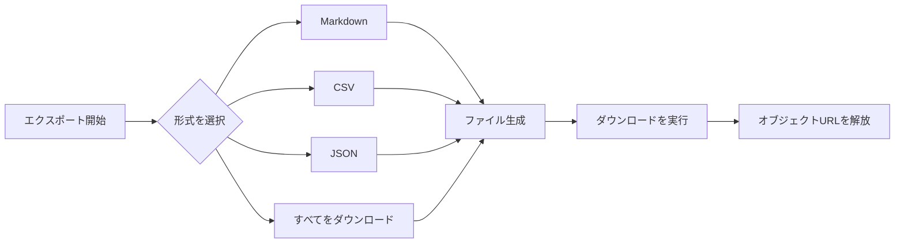
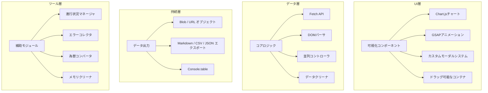

# DLsite 購入分析ツール

📈 ユーザー行動に基づくDLsite購入記録の深度分析ツール、可視化チャート、インタラクティブなポップアップ、スマートなデータエクスポートをサポート  
  - DLsite.jsのコードをブラウザコンソールにコピーしてお使いください

---

## 🚀 核心アップデートポイント

- **全新可視化システム**：Chart.jsの動的チャートを統合
- **強化されたインタラクション体験**：ネイティブポップアップをカスタムモーダルに置換し、比較/ダウンロード/リセットの固定ボタンを追加
- **三言語UI + 為替レート記憶**：中国語/英語/日本語を切り替え、言語ごとに為替設定を記憶
- **スマートなエラーハンドリング**：リアルタイムエラーログ記録と自動リトライメカニズム
- **結果ウィンドウのリアルタイムフィルター**：キーワード・サークル・日付・価格で絞り込むと表とグラフが即時再描画
- **データ比較分析機能の追加**：指定された時間枠内の購入数と支出を多角的に比較   
  *(バージョン履歴v2.2を参照)*
- **多形式ダウンロードの追加**：チャートのPNG出力に加え、結果を Markdown/CSV/JSON で保存可能  
  *(バージョン履歴v2.2 と v2.4 を参照)*

---

## 🌟 機能特性

### 🖥️ インタラクションシステム
- ダイナミックポップアップシステム（選択/確認/入力のサポート）
- 言語切替と比較/ダウンロード/リセットの固定ボタン
- ドラッグ可能・リサイズ可能なチャート/結果ウィンドウ   
  *(注：新しい結果ウィンドウが既存のコンソール出力を置換し、すべての統計データとチャートが独立したウィンドウに表示されます)*
- 結果ウィンドウ内のリアルタイムフィルターでリストとグラフを即時更新
- GSAPアニメーショントランジション効果
- リアルタイム進行状況バーのフィードバック（コンソールとページの両方で表示をサポート）

### 📊 データ分析
- **四次元チャートシステム**：
  - タイプ/制作グループ統計図（棒グラフ ↔ 円グラフの双方向切り替えをサポート）
  - 日別購入トレンド折れ線図
  - 累積消費金額曲線  
    *(チャートをクリックして詳細な作品情報と当日の総額を確認できます)*
- **データ比較分析機能**：   
  新しい比較モジュールは、ユーザーが2つの時間枠を選択し、以下の方面をそれぞれ統計することができます：
  - 異なるタイプの作品の好みの比較
  - 異なる制作グループの好みの比較
  - 制作グループ全体の比較（購入数と消費金額）
  - 制作グループの作品タイプの比較   
  比較結果は、統一された比較チャートコンテナに組み合わせた棒グラフの形で表示されます。
- **多次元フィルター**：キーワード/サークル/日付/価格/最小作品数でリストとグラフを同時に再描画
- 為替換算システム（リアルタイム変更と言語別デフォルトをサポート）
- クイックモード（合計のみ）と詳細モード（ジャンル/タグ取得）の切替が可能
- 下架作品とタイムラインを独立セクションで表示し、追跡しやすく

### 🛡️ 拡張機能
- 自動ページ検出とスマートジャンプ
- 下架作品独立マークシステム
- データサンドボックスモード（統計スピードを300%向上）
- クラッシュリカバリメカニズム（グローバルコマンド`window.reloadData`を使用してリカバリ）
- 言語切替時にUIを即時再描画し、為替設定を保持

### 📦 出力システム
- 多形式エクスポートサポート（Markdown / CSV / JSON、単体または一括ダウンロード）
- ダウンロード用の固定ボタンと、各チャート内のPNG保存ボタン
- モバイルデバイスの表示に適応
- エラーログトレース機能

---

## 🛠️ 使用ガイド

### 環境準備
```javascript
// 最新ブラウザの要件
Chrome 89+ / Firefox 86+ / Edge 91+
```

### クイックスタート
1. [DLsite購入記録ページ](https://www.dlsite.com/maniax/mypage/userbuy)にログイン
2. デベロッパーツールを開く（F12）
3. コンソールパネルに完全なコードを貼り付ける
4. 実行後、右上の言語切替でUIと言語別レートを調整し、左上のボタンで比較/ダウンロード/リセットを操作

## 🔄 インタラクションフローの詳細解説

```mermaid
graph TD
    A[スクリプトの開始] --> B{ページ検出}
    B -->|DLsiteページ| C[ウェルカムバナーを表示]
    B -->|対象外| D[ジャンプ確認を表示]
    D --> E{ユーザー選択}
    E -->|ジャンプ| F[購入記録ページへリダイレクト]
    E -->|キャンセル| G[スクリプト停止]
    
    C --> H[言語スイッチャーを描画]
    H --> I[モード選択ダイアログ]
    I --> J[比較/ダウンロード/リセットボタンを設置]
    J --> K{モードを選択}
    K -->|クイックモード| L[詳細取得をスキップ]
    K -->|詳細モード| M[作品タイプ選択を開始]
    
    M --> N[タイプフィルターを表示]
    N --> O{タイプを選択}
    O -->|0 (すべて)| P[デフォルトURLを維持]
    O -->|特定タイプ| Q[リクエストパラメータを変更]
    
    L --> R[為替設定ダイアログ]
    M --> R
    R --> S{レートを編集?}
    S -->|はい| T[数値入力]
    S -->|いいえ| U[言語デフォルトレートを使用]
    
    T --> V[入力検証]
    V -->|有効| W[レートを更新]
    V -->|無効| X[エラーを表示しデフォルトに戻す]
    
    W --> Y[データ取得を開始]
    U --> Y
    Y --> Z[二重進行状況フィードバック]
    Z --> AA[[ページ上の進行バー]]
    Z --> AB[コンソールページング表示]
    
    Y --> AC[データクレンジング]
    AC --> AD{下架作品あり?}
    AD -->|はい| AE[EOLリストをマーク]
    AD -->|いいえ| AF[統計段階へ]
    
    AF --> AG[フィルター閾値を入力]
    AG --> AH[最小作品数を設定]
    AH --> AI[データフィルターを実行]
    AI --> AJ[結果/チャート設定ダイアログ]
    AJ --> AK{グラフを表示?}
    AK -->|はい| AL[Chart.jsを非同期読み込み]
    AK -->|いいえ| AM[グラフ描画をスキップ]
    
    AL --> AN[4つのチャートコンテナ生成]
    AN --> AO[ユーザー操作]
    AO --> AP[グラフタイプ切替]
    AO --> AQ[ウィンドウのドラッグ/リサイズ]
    AO --> AR[リアルタイムフィルター反映]
    
    AM --> AS[結果エクスポートダイアログ]
    AJ --> AS
    AS --> AT{ファイルを保存?}
    AT -->|はい| AU[Markdown/CSV/JSON または一括を選択]
    AT -->|いいえ| AV[コンソールのみ出力]
    AU --> AW[ファイル生成とダウンロード]
    
    AV --> AX[整形テーブルを表示]
    AX --> AY[タイムラインを展開]
    AY --> AZ[コンソール折りたたみ表示]
    
    AZ --> BA[エラー検出モジュール]
    BA --> BB{エラーログあり?}
    BB -->|はい| BC[エントリを強調表示]
    BB -->|いいえ| BD[成功アイコンを表示]
    
    BD --> BE[作者情報を表示]
    BE --> BF[プロジェクトURLを表示]
    BF --> BG[スクリプト終了]
    
    %% データ比較フロー
    BG --> BH[比較モジュールを起動]
    BH --> BI[期間と比較軸を選択]
    BI --> BJ[複合棒グラフを生成]
```


### キーインタラクションノードの説明

#### 1. ダイナミックポップアップシステム
- **三层ポップアップアーキテクチャ**：
  - 基礎層：半透明オーバーレイ（`.modal-overlay`）
  - コンテンツ層：アダプティブコンテナ（`.modal-container`）
  - 操作層：ボタングループ（`.btn`クラスター）
- **スマートフォーカス**：最後のポップアップは常に最高のz-indexを取得

#### 2. チャートインタラクション
- **インスタントリドロー**：切り替えボタンをクリックして古いChartインスタンスを破壊し、再構築する
- **メモリ機能**：各チャートのタイプ状態（棒グラフ/円グラフ）はグローバル変数に独立して保存される
- **レスポンシブデザイン**：
  ```javascript
  // ウィンドウリサイズイベントリスナー
  container.style.resize = "both";
  // キャンバスサイズを自動調整
  canvas.style.width = "100%";
  canvas.style.height = "calc(100% - 30px)";
  ```

#### 3. データ取得フロー


#### 4. 例外処理パス
```mermaid
graph TD
    A[スクリプトの開始] --> B{ページ検出}
    B -->|DLsiteページ| C[ウェルカムバナーを表示]
    B -->|対象外| D[ジャンプ確認を表示]
    D --> E{ユーザー選択}
    E -->|ジャンプ| F[購入記録ページへリダイレクト]
    E -->|キャンセル| G[スクリプト停止]
    
    C --> H[言語スイッチャーを描画]
    H --> I[モード選択ダイアログ]
    I --> J[比較/ダウンロード/リセットボタンを設置]
    J --> K{モードを選択}
    K -->|クイックモード| L[詳細取得をスキップ]
    K -->|詳細モード| M[作品タイプ選択を開始]
    
    M --> N[タイプフィルターを表示]
    N --> O{タイプを選択}
    O -->|0 (すべて)| P[デフォルトURLを維持]
    O -->|特定タイプ| Q[リクエストパラメータを変更]
    
    L --> R[為替設定ダイアログ]
    M --> R
    R --> S{レートを編集?}
    S -->|はい| T[数値入力]
    S -->|いいえ| U[言語デフォルトレートを使用]
    
    T --> V[入力検証]
    V -->|有効| W[レートを更新]
    V -->|無効| X[エラーを表示しデフォルトに戻す]
    
    W --> Y[データ取得を開始]
    U --> Y
    Y --> Z[二重進行状況フィードバック]
    Z --> AA[[ページ上の進行バー]]
    Z --> AB[コンソールページング表示]
    
    Y --> AC[データクレンジング]
    AC --> AD{下架作品あり?}
    AD -->|はい| AE[EOLリストをマーク]
    AD -->|いいえ| AF[統計段階へ]
    
    AF --> AG[フィルター閾値を入力]
    AG --> AH[最小作品数を設定]
    AH --> AI[データフィルターを実行]
    AI --> AJ[結果/チャート設定ダイアログ]
    AJ --> AK{グラフを表示?}
    AK -->|はい| AL[Chart.jsを非同期読み込み]
    AK -->|いいえ| AM[グラフ描画をスキップ]
    
    AL --> AN[4つのチャートコンテナ生成]
    AN --> AO[ユーザー操作]
    AO --> AP[グラフタイプ切替]
    AO --> AQ[ウィンドウのドラッグ/リサイズ]
    AO --> AR[リアルタイムフィルター反映]
    
    AM --> AS[結果エクスポートダイアログ]
    AJ --> AS
    AS --> AT{ファイルを保存?}
    AT -->|はい| AU[Markdown/CSV/JSON または一括を選択]
    AT -->|いいえ| AV[コンソールのみ出力]
    AU --> AW[ファイル生成とダウンロード]
    
    AV --> AX[整形テーブルを表示]
    AX --> AY[タイムラインを展開]
    AY --> AZ[コンソール折りたたみ表示]
    
    AZ --> BA[エラー検出モジュール]
    BA --> BB{エラーログあり?}
    BB -->|はい| BC[エントリを強調表示]
    BB -->|いいえ| BD[成功アイコンを表示]
    
    BD --> BE[作者情報を表示]
    BE --> BF[プロジェクトURLを表示]
    BF --> BG[スクリプト終了]
    
    %% データ比較フロー
    BG --> BH[比較モジュールを起動]
    BH --> BI[期間と比較軸を選択]
    BI --> BJ[複合棒グラフを生成]
```


#### 5. ファイルエクスポートフロー


---

## ⚙️ パラメータ設定

### モード選択
| オプション   | 機能説明                                   |
| ------ | ------------------------------------------ |
| クイックモード | 基本的な消費データのみを統計（詳細を取得をスキップ）          |
| 詳細モード | 完全なラベル分析 + 主タイプ統計                  |

### 高度な設定
```markdown
1. 為替校正：CNY(0.048)/USD(0.0064)/JPY(1) を内蔵し、言語ごとに記憶して編集可能
2. フィルタしきい値：数字Nを入力すると、作品数 < Nの分類を自動的にフィルタ
3. チャート設定：各チャートは独立して表示タイプ（棒グラフ/円グラフ）を記憶
```

---

## 📊 出力例

### コンソール出力
```markdown
✦ DLsite購入履歴統計 ✦
購入作品数：189 部
累積消費金額：¥82,450 JPY（≈¥3,987.51 CNY）

★ 各種類統計 ★
同人音声    | ██████████ 58
成人向けゲーム  | ███████ 37
漫画コレクション    | █████ 25

★ チャートシステム ★
[動的ウィンドウ1] タイプ分布（棒グラフ/円グラフ切り替え）
[動的ウィンドウ2] 制作グループランキング（棒グラフ/円グラフ切り替え）
[動的ウィンドウ3] 消費トレンド折れ線図
[動的ウィンドウ4] 累積消費金額曲線
```

### ファイルエクスポート
```markdown
# DLsite購入履歴調査報告

## 消費軌跡分析


## 異常記録
| 日付       | 作品名         | 状態   |
|------------|------------------|--------|
| 2025/03/05 | [下架済み]作品X    | 404    |
```

---

## ⚠️ 注意事項

### パフォーマンス最適化
```markdown
1. PC端で実行することをお勧め（モバイル端は自動的に表示に適応するが機能が制限される）
2. 作品数が100以上の場合、クイックモードをオンにすることをお勧め
3. `window.clearLogs`を使用してメモリをクリア
```

### エラーハンドリング
```markdown
ネットワークエラーが発生した場合：
1. 自動的に3回リトライ
2. エラーログはerrorLogs配列に保存
3. reloadDataコマンドで復元をサポート
```

---

## 🏗️ 技術アーキテクチャ詳細

### システムレイヤーアーキテクチャ


### キーテクノロジースタック

#### コア依存ライブラリ
| ライブラリ/技術         | バージョン    | 用途               | キー実装関数                         |
| --------------- | ------- | ------------------ | ------------------------------------ |
| **Chart.js**    | 4.4.0   | データ可視化         | `drawGenreChart()`、`drawMakerChart()` など |
| **GSAP**        | 3.12.0  | アニメーションエンジン           | `animateModalIn()`、`fadeOut()`        |
| **DOMParser**   | ネイティブ  | DOM解析             | `processPage()` データ抽出               |
| **Blob + URL API** | ネイティブ | ファイルエクスポート           | `downloadFile()` で Markdown/CSV/JSON を保存 |

#### ネイティブ技術応用
```markdown
1. **WebアニメーションAPI**  
   - 進行状況バーの動的効果を実現
   - コンソール進行アニメーション（ASCII文字）

2. **CSS Grid/Flex**  
   - レスポンシブチャートコンテナレイアウト
   - モーダルウィンドウのアダプティブレイアウト

3. **ResizeObserver**  
   - チャートウィンドウのリサイズイベントを监听
   - キャンバスサイズを動的に調整

4. **Proxy API**  
   - グローバル状態管理（エラーログ/チャートタイプ状態）
```

### キーモジュール実装

#### 1. 並列コントロールシステム
```javascript
// 最大並列数制御
const MAX_CONCURRENT = 5;
let activePromises = 0;

async function controlledFetch(url) {
  while (activePromises >= MAX_CONCURRENT) {
    await new Promise(resolve => setTimeout(resolve, 500));
  }
  activePromises++;
  try {
    return await fetch(url);
  } finally {
    activePromises--;
  }
}
```

#### 2. メモリ管理メカニズム
```javascript
// スマートクリア戦略
const memoryWatcher = {
  threshold: 0.8, // メモリ使用しきい値
  cleanup() {
    if (performance.memory.usedJSHeapSize / 
        performance.memory.jsHeapSizeLimit > this.threshold) {
      this.forceCleanup();
    }
  },
  forceCleanup() {
    genreChartObj?.destroy();
    makerChartObj?.destroy();
    URL.revokeObjectURL(blobCache);
  }
};

// 60秒ごとに検出
setInterval(() => memoryWatcher.cleanup(), 60000);
```

#### 3. アニメーションシステムアーキテクチャ


### パフォーマンス最適化戦略

#### データ取得の最適化
```markdown
1. **ページ事前ロード**  
   - Promise.allSettled()を使用して並列リクエスト
   - ネットワーク遅延に応じて動的に並列数を調整

2. **DOMキャッシュ**  
   - 既に解析されたドキュメントオブジェクトを再利用
   - セレクタ結果キャッシュプール

3. **増分レンダリング**  
   - 50msごとに10個のノードを処理してDOMノードをバッチ処理
```

#### チャートの最適化
```javascript
// Canvasレンダリングの最適化
Chart.defaults.animation = false; // デフォルトアニメーションを無効化
Chart.defaults.datasets.bar.barThickness = 25; // 固定バー幅
Chart.defaults.elements.point.radius = 3; // データポイントを最適化

// スマートリドローストラテジー
function debouncedRedraw() {
  let isRendering = false;
  return () => {
    if (!isRendering) {
      requestAnimationFrame(() => {
        genreChartObj?.update();
        makerChartObj?.update();
        isRendering = false;
      });
      isRendering = true;
    }
  };
}
```

### セキュリティメカニズム
```markdown
1. **サンドボックスモード**  
   - Proxyを使用してグローバル変数をカプセル化
   - メモリ操作権限を制限

2. **入力検証**  
   ```javascript
   // 為替入力検証
   const value = parseFloat(input);
   const isValid = !Number.isNaN(value) && value > 0;
   const rate = isValid ? value : defaultRate;
   ```

### CORS処理
   - 動的にno-corsモードを追加
   - 失敗リクエストは指数バックオフアルゴリズムで自動リトライ


> 📌 **アーキテクチャ設計原則**  
> 1. モジュール化設計 - 各機能モジュールの最大コード行数 ≤ 200  
> 2. メモリセキュリティ - オブジェクト破棄後にGCを自動的にトリガー  
> 3. グレープアップ - コア機能はサードパーティーライブラリに依存しない  
> 4. モバイルファースト - すべてのコンポーネントはモバイルタッチに適応

---

## 📌 バージョン履歴

### v2.4 (2025/04/22)
- JSONエクスポートを追加し、一括ダウンロードをサポート
- 三言語スイッチャーと為替レート記憶を導入し、言語変更時にUIとグラフを再描画

### v2.3 (2025/03/18)
- バグ修正
- 構造を改善し、結果ウィンドウにキーワード/サークル/日付/価格フィルターと比較/ダウンロード/リセットボタンを追加

### v2.2 (2025/03/08)
- データ比較分析機能を追加（一定期間の購入作品数と支出を比較）
- チャートダウンロード機能を追加

### v2.1 (2025/03/07)
- 結果ウィンドウを追加し、ユーザーがコンソール出力を確認する必要をなくしました

### v2.0 (2025/03/03)
- 四次元チャートシステムを追加
- インタラクションシステムを再構築（alert/promptをすべてカスタムモーダルに置換）
- ウィンドウドラッグ&リサイズ機能を追加
- モバイルデバイスのアダプティブ性を最適化
- サンドボックスモードメモリ管理を実装
- GSAPアニメーションエンジンサポートを追加
- エラーハンドリングシステムをアップグレード

### v1.2 (2025/02/24)
- CSVエクスポート機能を強化
- コンソール表示ロジックを最適化

---

## 📄 ライセンス
MITライセンス | 商業用途は禁止  
完全な声明はコードのヘッダーコメントを参照

---

> 🌐 プロジェクトアドレス：https://github.com/linyaocrush/DLsite-Purchase-Analyzer  
> 📧 問題フィードバック：コントロールコンソールのエラーのスクリーンショットを添付してIssueを作成してください
