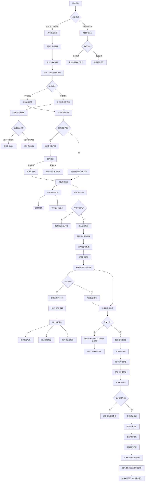
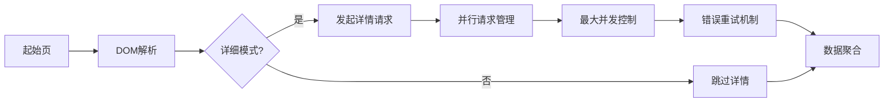
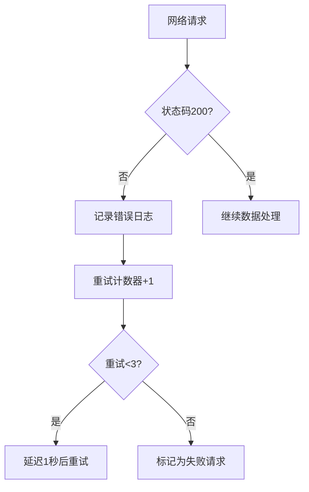
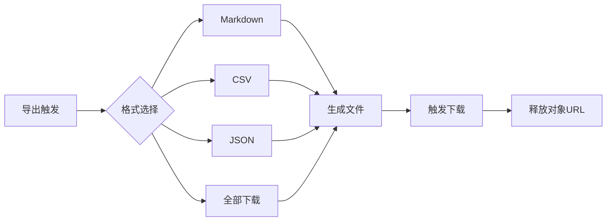
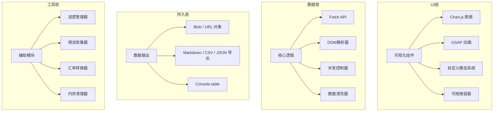
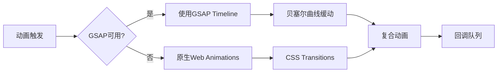

<a href="https://github.com/linyaocrush/DLsite-Purchase-Analyzer/blob/main/README-JP.md" target="_blank">日本語</a> / <a href="https://github.com/linyaocrush/DLsite-Purchase-Analyzer/blob/main/readme-EN.md" target="_blank">ENGLISH</a>

# DLsite 购买分析工具

📈 基于用户行为的DLsite购买记录深度分析工具，支持可视化图表、交互式弹窗和智能数据导出  
  - 请复制DLsite.js中的代码到浏览器控制台使用

---

## 🚀 核心升级亮点

- **全新可视化系统**：集成 Chart.js 动态图表
- **增强交互体验**：完全自定义的模态窗口替代原生弹窗，新增对比/下载/重置浮动按钮
- **三语界面 + 汇率记忆**：中文/英文/日文随时切换，不同语言各自记忆汇率配置
- **智能错误处理**：实时错误日志记录与自动重试机制
- **结果窗口实时筛选**：关键词、制作组、日期与价格过滤会同步刷新表格与图表
- **新增数据对比分析功能**：可对指定时间段内的购买数量和花费进行多角度对比  
  *(参见版本历史 v2.2)*
- **新增多格式下载**：图表 PNG 导出与结果 Markdown/CSV/JSON 下载  
  *(参见版本历史 v2.2 与 v2.4)*

---

## 🌟 功能特性

### 🖥️ 交互系统
- 动态弹窗系统（支持选择/确认/输入）
- 固定在页面角落的语言切换器，以及对比/下载/重置快速按钮
- 可拖拽、缩放的图表与结果窗口  
  *(注：新增的结果窗口替代了原有控制台输出，所有统计数据和图表均在独立窗口显示)*
- 结果窗口内置实时过滤器，输入条件即可即时刷新列表与图表
- GSAP 动画过渡效果
- 实时进度条反馈（支持控制台和页面双显示）

### 📊 数据分析
- **四维图表系统**：
  - 类型/制作组统计图（支持柱状图 ↔ 饼图双向切换）
  - 每日购买趋势折线图
  - 累计消费金额曲线  
    *(点击图表可查看详细的作品信息和当天总价)*
- **数据对比分析功能**：  
  新增对比模块支持用户选择两个时间段，分别统计以下方面：
  - 不同类型作品偏好对比
  - 不同制作组偏好对比
  - 制作组整体对比（购买数量与消费金额）
  - 制作组作品类型对比  
  对比结果以组合柱状图形式展示在统一的对比图表容器中。
- **多维筛选系统**：关键词、制作组、日期、价格与最小作品数过滤，图表与表格同步重绘
- 汇率换算系统（支持实时汇率修改与语言独立记忆）
- 快速模式（仅金额统计）与详细模式（抓取作品类型与标签）可自由切换
- 下架作品与时间轴视图单独分组，便于回溯

### 🛡️ 增强功能
- 自动页面检测与智能跳转
- 下架作品独立标记系统
- 数据沙盒模式（快速统计提速300%）
- 崩溃恢复机制（通过全局命令 `window.reloadData` 进行恢复）
- 语言切换即时刷新界面并保留当前汇率配置

### 📦 输出系统
- 多格式导出支持（Markdown / CSV / JSON，可单独或一次性全部下载）
- 浮动下载按钮与图表内置 PNG 保存入口
- 自适应移动端显示
- 错误日志追溯功能

---

## 🛠️ 使用指南

### 环境准备
```javascript
// 最新浏览器要求
Chrome 89+ / Firefox 86+ / Edge 91+
```

### 快速启动
1. 登录 [DLsite购买记录页](https://www.dlsite.com/maniax/mypage/userbuy)
2. 打开开发者工具（F12）
3. 在 Console 面板粘贴完整代码
4. 运行后可通过右上角语言切换器调整界面语言与汇率，左上角按钮进行对比/下载/重置

## 🔄 交互流程详解



### 关键交互节点说明

#### 1. 动态弹窗系统
- **三层弹窗架构**：
  - 基础层：半透明遮罩（`.modal-overlay`）
  - 内容层：自适应容器（`.modal-container`）
  - 操作层：按钮组（`.btn`集群）
- **智能聚焦**：最后一个弹窗始终获得最高 z-index

#### 2. 图表交互
- **即时重绘**：点击切换按钮时销毁旧 Chart 实例并重建
- **记忆功能**：各图表类型状态（柱状图/饼图）独立存储于全局变量
- **响应式设计**：
  ```javascript
  // 窗口缩放事件监听
  container.style.resize = "both";
  // 画布尺寸自适应
  canvas.style.width = "100%";
  canvas.style.height = "calc(100% - 30px)";
  ```

#### 3. 数据抓取流程


#### 4. 异常处理路径


#### 5. 文件导出流程


---

## ⚙️ 参数配置

### 模式选择
| 选项   | 功能说明                                   |
| ------ | ------------------------------------------ |
| 快速模式 | 仅统计基础消费数据（跳过详情请求）          |
| 详细模式 | 完整标签分析 + 主类型统计                  |

### 高级设置
```markdown
1. 汇率校准：内置 CNY(0.048)、USD(0.0064)、JPY(1) 默认值，可按语言独立修改并记忆
2. 过滤阈值：输入数字 N 将自动过滤作品数 < N 的分类
3. 图表配置：每个图表独立记忆显示类型（柱状图/饼图）
```

---

## 📊 输出示例

### 控制台输出
```markdown
✦ DLsite购买历史统计 ✦
共购买作品：189 部
累计消费金额：¥82,450 JPY（≈¥3,987.51 CNY）

★ 各类型统计 ★
同人音声    | ██████████ 58
成人向游戏  | ███████ 37
漫画合集    | █████ 25

★ 图表系统 ★
[动态窗口1] 类型分布（柱状图/饼图切换）
[动态窗口2] 制作组排行（柱状图/饼图切换）
[动态窗口3] 消费趋势折线图
[动态窗口4] 累计消费金额曲线
```

### 文件导出
```markdown
# DLsite购买历史查询报告

## 消费轨迹分析


## 异常记录
| 日期       | 作品名称         | 状态   |
|------------|------------------|--------|
| 2025/03/05 | [已下架]作品X    | 404    |
```

---

## ⚠️ 注意事项

### 性能优化
```markdown
1. 推荐在 PC 端运行（移动端自动适配显示但功能受限）
2. 作品数量较多（100+）时建议开启快速模式
3. 使用 `window.clearLogs` 清理内存
```

### 错误处理
```markdown
遇到网络错误时：
1. 自动重试3次
2. 错误日志存储在 errorLogs 数组
3. 支持通过 reloadData 命令恢复
```

---

## 🏗️ 技术架构详解

### 系统分层架构


### 关键技术栈

#### 核心依赖库
| 库/技术         | 版本    | 用途               | 关键实现函数                         |
| --------------- | ------- | ------------------ | ------------------------------------ |
| **Chart.js**    | 4.4.0   | 数据可视化         | `drawGenreChart()`、`drawMakerChart()` 等 |
| **GSAP**        | 3.12.0  | 动画引擎           | `animateModalIn()`、`fadeOut()`        |
| **DOMParser**   | Native  | DOM解析             | `processPage()` 数据提取               |
| **Blob + URL API** | Native | 文件导出           | `downloadFile()` 触发 Markdown/CSV/JSON 下载 |

#### 原生技术应用
```markdown
1. **Web Animation API**  
   - 实现进度条动态效果
   - 控制台进度动画（ASCII字符）

2. **CSS Grid/Flex**  
   - 响应式图表容器布局
   - 模态窗口自适应布局

3. **ResizeObserver**  
   - 监听图表窗口缩放事件
   - 动态调整 Canvas 画布尺寸

4. **Proxy API**  
   - 全局状态管理（错误日志/图表类型状态）
```

### 关键模块实现

#### 1. 并发控制系统
```javascript
// 最大并行数控制
const MAX_CONCURRENT = 5;
let activePromises = 0;

async function controlledFetch(url) {
  while (activePromises >= MAX_CONCURRENT) {
    await new Promise(resolve => setTimeout(resolve, 500));
  }
  activePromises++;
  try {
    return await fetch(url);
  } finally {
    activePromises--;
  }
}
```

#### 2. 内存管理机制
```javascript
// 智能清理策略
const memoryWatcher = {
  threshold: 0.8, // 内存使用阈值
  cleanup() {
    if (performance.memory.usedJSHeapSize / 
        performance.memory.jsHeapSizeLimit > this.threshold) {
      this.forceCleanup();
    }
  },
  forceCleanup() {
    genreChartObj?.destroy();
    makerChartObj?.destroy();
    URL.revokeObjectURL(blobCache);
  }
};

// 每60秒检测一次
setInterval(() => memoryWatcher.cleanup(), 60000);
```

#### 3. 动画系统架构


### 性能优化策略

#### 数据抓取优化
```markdown
1. **分页预加载**  
   - 使用 Promise.allSettled() 并行请求
   - 动态调整并发数（根据网络延迟）

2. **DOM缓存**  
   - 复用已解析的文档对象
   - 选择器结果缓存池

3. **增量渲染**  
   - 分批次处理 DOM 节点（每50ms处理10个节点）
```

#### 图表优化
```javascript
// Canvas渲染优化
Chart.defaults.animation = false; // 禁用默认动画
Chart.defaults.datasets.bar.barThickness = 25; // 固定柱宽
Chart.defaults.elements.point.radius = 3; // 优化数据点

// 智能重绘策略
function debouncedRedraw() {
  let isRendering = false;
  return () => {
    if (!isRendering) {
      requestAnimationFrame(() => {
        genreChartObj?.update();
        makerChartObj?.update();
        isRendering = false;
      });
      isRendering = true;
    }
  };
}
```

### 安全机制
```markdown
1. **沙盒模式**  
   - 使用 Proxy 封装全局变量
   - 限制内存操作权限

2. **输入验证**  
   ```javascript
   // 汇率输入验证
   const value = parseFloat(input);
   const isValid = !Number.isNaN(value) && value > 0;
   const rate = isValid ? value : defaultRate;
   ```

 ### CORS处理
   - 动态添加 no-cors 模式
   - 失败请求自动重试（指数退避算法）


> 📌 **架构设计原则**  
> 1. 模块化设计 - 每个功能模块最大代码行数 ≤ 200  
> 2. 内存安全 - 对象销毁后自动触发 GC  
> 3. 渐进增强 - 核心功能不依赖第三方库  
> 4. 响应式优先 - 所有组件适配移动端触控

---

## 📌 版本历史
### v2.4 (2025/04/22)
- 新增 JSON 导出选项，支持一键下载全部格式
- 引入三语切换器与汇率记忆，切换语言后界面与图表自动重绘

### v2.3 (2025/03/18)
- 修复了BUG
- 优化脚本结构，结果窗口新增关键词/制作组/日期/价格筛选和对比/下载/重置按钮

### v2.2 (2025/03/08)
- 新增数据对比分析功能（对一定时间段的购买作品数量和花费做对比）
- 新增图表下载功能

### v2.1 (2025/03/07)
- 新增结果窗口，用户无需查看控制台输出

### v2.0 (2025/03/03)
- 新增四维图表系统
- 重构交互系统（弃用 alert/prompt，全部替换为自定义弹窗）
- 增加窗口拖拽缩放功能
- 优化移动端自适应
- 实现沙盒模式内存管理
- 添加 GSAP 动画引擎支持
- 错误处理系统升级

### v1.2 (2025/02/24)
- 增强 CSV 导出功能
- 优化控制台显示逻辑

---

## 📄 许可证
MIT License | 严禁用于商业用途  
完整声明见代码头部注释

---

> 🌐 项目地址：https://github.com/linyaocrush/DLsite-Purchase-Analyzer  
> 📧 问题反馈：请附带控制台错误截图创建 Issue

---
## Visitors (since 2025/03/17)


## 星标历史

<a href="https://star-history.com/#linyaocrush/DLsite-Purchase-Analyzer&Timeline">
 <picture>
   <source media="(prefers-color-scheme: dark)" srcset="https://api.star-history.com/svg?repos=linyaocrush/DLsite-Purchase-Analyzer&type=Timeline&theme=dark" />
   <source media="(prefers-color-scheme: light)" srcset="https://api.star-history.com/svg?repos=linyaocrush/DLsite-Purchase-Analyzer&type=Timeline" />
   
 </picture>
</a>
