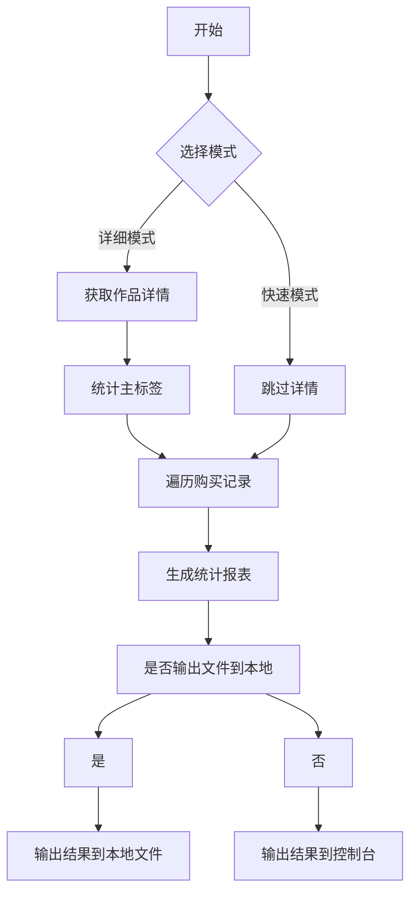

# DLsite 购买分析工具

📝 一个自动分析 DLsite 购买记录的 JavaScript 脚本，支持消费金额统计、作品类型分析、制作组排行等功能。

---

## 📋 功能特性
- ✅ **网页检测**  
  运行后自动检测所在页面是否正确，不正确会自动跳转
- ✅ **消费总览**  
  统计购买作品总数和累计消费金额（日元）
- :currency_exchange: **自动转换价格为人民币**  
  自动将获取到的日元价格转换为人民币
- 🏷️ **分类统计**  
  - 按类型/标签分析作品分布（同人/商业/漫画等）
  - 允许排除作品数少于设定值的类型/标签
- :medal_military: **制作组排行**  
  显示购买次数最多的制作组 TOP 列表
- ⚠️ **下架作品检测**  
  单独列出已下架作品的购买记录
- ⚡ **两种模式可选**  
  - **详细模式**：获取作品主标签和详细分类
  - **快速模式**：仅统计金额（提速 300%）
- :floppy_disk: **允许将结果输出到本地**  
  - 运行结束后可以选择将结果保存到本地
  - 可以保存为MD或者CSV(CSV在某些情况下可能会乱码，因此不是很建议)
---

## 🛠️ 使用教程

### 准备工作
1. 登录 [DLsite 用户购买记录页面](https://www.dlsite.com/maniax/mypage/userbuy)
2. 打开浏览器开发者工具（Chrome 按 `F12`）
3. 进入 **Console** 面板

### 快速开始
```javascript
// 将完整代码粘贴到控制台并回车
// 脚本将引导您完成后续操作
```

---

## ⚙️ 参数配置说明

### 1. 模式选择
```markdown
当出现此提示时：
"是否开启快速查看消费金额？（仅统计金额，输入 'Y' 或 'N'）"

- 输入 `Y`：快速模式（不获取作品详情）
- 输入 `N`：详细模式（获取完整分类信息）
```

### 2. 作品类型筛选
系统会显示以下参数列表：

| 参数值 | 作品类型说明           |
|--------|------------------------|
| 0      | 同人：所有             |
| 2      | 同人：全年齢           |
| 1      | 同人：男性向け         |
| ...    | ...（完整列表见代码）  |

**输入示例**：  
要统计所有类型游戏，请输入 `0`

---

### 3. 汇率更改
```markdown
当出现此提示时：
"是否需要修改汇率？输入 'Y' 修改，输入 'N' 使用默认汇率（1人民币 = 0.04858日元）"

- 输入 `Y`：修改（自行填写汇率）
- 输入 `N`：使用默认汇率
```

### 4. 输出结果
```markdown
当出现此提示时：
"统计完成！是否需要保存为文件？输入 'Y' 保存，输入 'N' 不保存"

- 输入 `Y`：下载结果到本地
- 输入 `N`：输出结果在控制台
```

## 📊 输出示例
```markdown
统计结果：
共购买作品：127 部
合计消费金额：54800 日元

各类型作品数排名：
同人音声: 45 部
成人向けゲーム: 32 部
ボイス・ASMR: 28 部

各制作组作品数排名：
サークルA: 12 部
メーカーB: 9 部
同人サークルC: 7 部

以下作品已下架：共计 3 部

购买日期: 2023/05/01
制作组: [已下架]
作品名称: 作品X
```

---

## ⚠️ 注意事项
1. **登录状态**  
   需保持 DLsite 登录状态（脚本使用 `withCredentials` 携带 Cookie）
2. **跨域限制**  
   若遇 CORS 错误，需：
   ```javascript
   // Chrome 启动时添加参数
   chrome.exe --disable-web-security --user-data-dir="C:/temp"
   ```
3. **性能提示**  
   详细模式每个作品需额外请求页面，100+ 作品可能需要 2-3 分钟
4. **数据精度**  
   下架作品无法获取价格，不计入消费总额

---

## 📌 实现原理


---

## 📜 许可证
本项目使用 [MIT License](LICENSE)，可自由修改和分发。使用本脚本即表示您知晓：
- 仅用于个人数据统计
- 不涉及 DLsite 服务器压力测试

---

> 📧 问题反馈：通过 Issues 提交您遇到的异常情况（附控制台截图）

---

## 📋 更新历史
- **2025/3/3**
  - 增加了检测网页是否正确的功能
  - 优化加载动画
  - 添加了错误日志和自动重试功能（3次）
  - 美化了询问窗口和结果输出，不在使用游览器弹窗作为询问窗口
  - 在下载MD文件前会显示预览
  - 在结果输出时添加了统计图标（柱状图）
- **2025/2/24**  
  - 增加了保存为CSV的选项
  - 美化了输出结果
- **2025/2/23**  
  - 优化了快速模式下的提问，去除不必要的提问。
