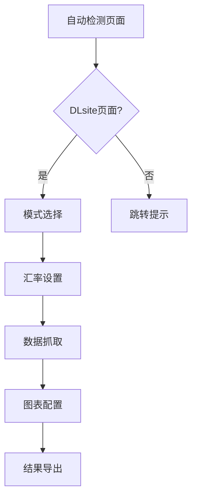
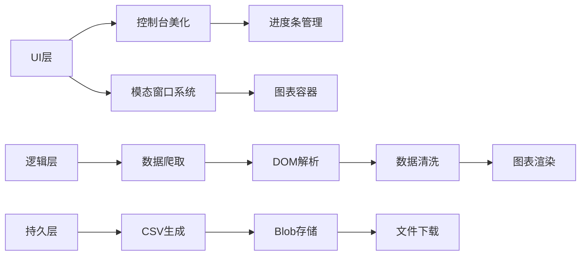

# DLsite 购买分析工具 v2.0

📈 基于用户行为的DLsite购买记录深度分析工具，支持可视化图表、交互式弹窗和智能数据导出

---

## 🚀 核心升级亮点
- **全新可视化系统**：集成 Chart.js 动态图表
- **增强交互体验**：完全自定义的模态窗口替代原生弹窗
- **智能错误处理**：实时错误日志记录与自动重试机制

---

## 🌟 功能特性

### 🖥️ 交互系统
- 动态弹窗系统（支持选择/确认/输入）
- 可拖拽缩放图表窗口
- GSAP 动画过渡效果
- 实时进度条反馈（支持控制台和页面双显示）

### 📊 数据分析
- **四维图表系统**：
  - 类型/制作组统计图（柱状图 ↔ 饼图双向切换）
  - 每日购买趋势折线图
  - 累计消费金额曲线
  - 时间轴分组视图（控制台交互式展示）
- 智能过滤系统（按最小作品数过滤次要数据）
- 汇率换算系统（支持实时汇率修改）

### 🛡️ 增强功能
- 自动页面检测与智能跳转
- 下架作品独立标记系统
- 数据沙盒模式（快速统计提速300%）
- 崩溃恢复机制（`window.reloadData`全局命令）

### 📦 输出系统
- 多格式导出支持（MD预览/CSV/控制台表格）
- 自适应移动端显示
- 错误日志追溯功能
- 作者信息水印系统

---

## 🛠️ 使用指南

### 环境准备
```javascript
// 最新浏览器要求
Chrome 89+ / Firefox 86+ / Edge 91+
```

### 快速启动
1. 登录 [DLsite购买记录页](https://www.dlsite.com/maniax/mypage/userbuy)
2. 打开开发者工具（F12）
3. 在Console面板粘贴完整代码

### 交互流程


---

## ⚙️ 参数配置

### 模式选择
| 选项 | 功能说明 |
|------|----------|
| 快速模式 | 仅统计基础消费数据（跳过详情请求） |
| 详细模式 | 完整标签分析 + 主类型统计 |

### 高级设置
```markdown
1. 汇率校准：默认 1CNY=0.04858JPY，支持精确到小数点后6位
2. 过滤阈值：输入数字N将自动过滤作品数<N的分类
3. 图表配置：每个图表独立记忆显示类型（柱状图/饼图）
```

---

## 📊 输出示例

### 控制台输出
```markdown
✦ DLsite购买历史统计 ✦
共购买作品：189 部
累计消费金额：¥82,450 JPY（≈¥3,987.51 CNY）

★ 各类型统计 ★
同人音声    | ██████████ 58
成人向游戏  | ███████ 37
漫画合集    | █████ 25

★ 图表系统 ★
[动态窗口1] 类型分布（柱状图）
[动态窗口2] 制作组排行（饼图）
[动态窗口3] 消费趋势折线图
```

### 文件导出
```markdown
# DLsite购买历史查询报告

## 消费轨迹分析


## 异常记录
| 日期       | 作品名称         | 状态   |
|------------|------------------|--------|
| 2025/03/05 | [已下架]作品X    | 404    |
```

---

## ⚠️ 注意事项

### 性能优化
```markdown
1. 推荐在PC端运行（移动端自动适配显示但功能受限）
2. 100+作品建议开启快速模式
3. 使用 `window.clearLogs` 清理内存
```

### 错误处理
```markdown
遇到网络错误时：
1. 自动重试3次
2. 错误日志存储在 errorLogs 数组
3. 支持通过 reloadData 命令恢复
```

---

## 📜 实现架构


---

## 📌 版本历史

### v2.0 (2025/03/03)
- 新增四维图表系统
- 重构交互系统（弃用alert/prompt）
- 增加窗口拖拽缩放功能
- 优化移动端自适应
- 实现沙盒模式内存管理
- 添加GSAP动画引擎支持
- 错误处理系统升级

### v1.2 (2025/02/24)
- 增强CSV导出功能
- 优化控制台显示逻辑

---

## 📄 许可证
MIT License | 严禁用于商业用途  
完整声明见代码头部注释

---

> 🌐 项目地址：https://github.com/linyaocrush/DLsite-Purchase-Analyzer  
> 📧 问题反馈：附带控制台错误截图创建Issue
```
