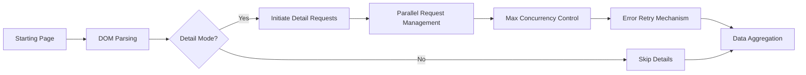
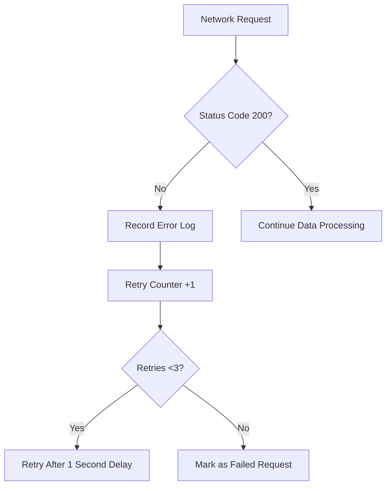
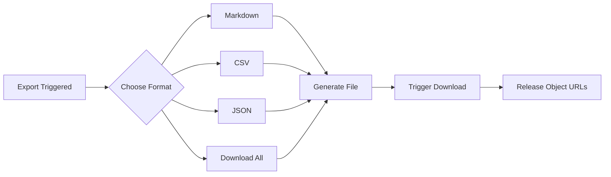
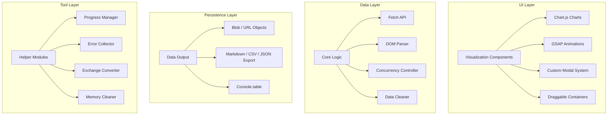
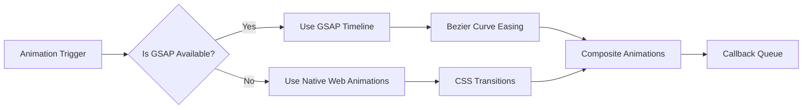

# DLsite Purchase Analysis Tool

📈 A deep analysis tool for DLsite purchase records based on user behavior, supporting visual charts, interactive pop-ups, and smart data export
- Please copy the code from DLsite.js into the browser console to use

---

## 🚀 Core Upgrade Highlights

- **New Visualization System**: Integrated dynamic charts with Chart.js
- **Enhanced Interaction Experience**: Replaced native pop-ups with fully customizable modal windows plus floating compare/download/reset controls
- **Triple-Language UI + Rate Memory**: Switch among Chinese/English/Japanese and keep exchange rate per language
- **Smart Error Handling**: Real-time error log recording and auto-retry mechanism
- **Interactive Result Filtering**: Keyword, maker, date, and price filters redraw tables and charts instantly
- **Added Data Comparison Analysis Feature**: Compare purchases and spending across different time periods  
  *(See version history v2.2)*
- **Added Multi-Format Downloads**: Save chart PNGs and export results as Markdown/CSV/JSON  
  *(See version history v2.2 & v2.4)*

---

## 🌟 Functional Characteristics

### 🖥️ Interaction System
- Dynamic pop-up system (supports selection, confirmation, and input)
- Fixed language switcher plus quick buttons for comparison/download/reset
- Drag-and-drop, resizable chart and result windows  
  *(Note: New result windows have replaced the original console output, with all statistics and charts displayed in independent windows)*
- Built-in real-time filters in the result window; updates propagate to lists and charts
- GSAP animation transition effects
- Real-time progress bar feedback (supports display in both console and page)

### 📊 Data Analysis
- **Four-Dimensional Chart System**:
  - Genre/creator group statistics charts (supports switching between bar and pie charts)
  - Daily purchase trend line chart
  - Cumulative spending curve
    *(Click charts to view detailed work information and daily totals)*
- **Data Comparison Analysis Function**:
  The new comparison module allows users to select two time periods and compare the following aspects:
  - Comparison of preferences for different types of works
  - Comparison of preferences for different creator groups
  - Overall comparison of creator groups (number of purchases and spending amount)
  - Comparison of work types by creator group
  Comparison results are displayed in a unified comparison chart container in the form of combined bar charts.
- **Multi-dimensional Filtering**: Keyword, maker, date, price, and minimum-count filters redraw both lists and charts
- Exchange rate conversion system (supports real-time modification with language-specific defaults)
- Quick mode (totals only) and detail mode (fetches genres/tags) are switchable
- Discontinued works and the timeline view are grouped separately for easier tracing

### 🛡️ Enhanced Features
- Automatic page detection and smart jump
- Independent marking system for discontinued works
- Data sandbox mode (speeds up statistics by 300%)
- Crash recovery mechanism (restore via the global command `window.reloadData`)
- Language switching refreshes the UI instantly and preserves exchange-rate configuration

### 📦 Output System
- Support for multiple export formats (Markdown / CSV / JSON, export individually or all at once)
- Floating download button plus built-in PNG saving inside each chart window
- Adaptive display for mobile devices
- Error log tracing function

---

## 🛠️ Usage Guide

### Environment Preparation
```javascript
// Latest browser requirements
Chrome 89+ / Firefox 86+ / Edge 91+
```

### Quick Start
1. Log in to the [DLsite Purchase Records Page](https://www.dlsite.com/maniax/mypage/userbuy)
2. Open Developer Tools (F12)
3. Paste the full code into the Console panel
4. After running, use the top-right language switcher to adjust UI and rates; use the top-left buttons for compare/download/reset

## 🔄 Detailed Interaction Flow Explanation

```mermaid
graph TD
    A[Script Launch] --> B{Page Detection}
    B -->|On DLsite| C[Show Welcome Banner]
    B -->|Not on DLsite| D[Prompt to Jump]
    D --> E{User Choice}
    E -->|Confirm| F[Redirect to Purchase Records Page]
    E -->|Cancel| G[Stop Script]
    
    C --> H[Render Language Switcher]
    H --> I[Mode Selection Dialog]
    I --> J[Mount Download/Compare/Reset Buttons]
    J --> K{Choose Mode}
    K -->|Quick Mode| L[Skip Detail Fetching]
    K -->|Detail Mode| M[Open Work-Type Selector]
    
    M --> N[Pop Up Type Filter]
    N --> O{Choose Specific Type}
    O -->|Select 0 (All)| P[Keep Default URL]
    O -->|Select Specific Type| Q[Adjust Request Params]
    
    L --> R[Exchange Rate Dialog]
    M --> R
    R --> S{Edit Rate?}
    S -->|Yes| T[Number Input]
    S -->|No| U[Use Language Default Rate]
    
    T --> V[Validate Input]
    V -->|Valid| W[Update Rate]
    V -->|Invalid| X[Show Error and Restore Default]
    
    W --> Y[Start Fetching Data]
    U --> Y
    Y --> Z[Dual Progress Feedback]
    Z --> AA[[On-page Progress Bar]]
    Z --> AB[Console Pagination]
    
    Y --> AC[Data Cleaning]
    AC --> AD{Any Discontinued Works?}
    AD -->|Yes| AE[Mark EOL List]
    AD -->|No| AF[Enter Statistics Stage]
    
    AF --> AG[Filter Threshold Prompt]
    AG --> AH[Enter Minimum Works]
    AH --> AI[Run Data Filtering]
    AI --> AJ[Result/Chart Configuration Dialog]
    AJ --> AK{Show Charts?}
    AK -->|Yes| AL[Load Chart.js Asynchronously]
    AK -->|No| AM[Skip Chart Rendering]
    
    AL --> AN[Create Four-Chart Container]
    AN --> AO[User Interactions]
    AO --> AP[Switch Chart Type]
    AO --> AQ[Drag/Resize Windows]
    AO --> AR[Live Filter Refresh]
    
    AM --> AS[Result Export Dialog]
    AJ --> AS
    AS --> AT{Save Files?}
    AT -->|Yes| AU[Choose Markdown/CSV/JSON or All]
    AT -->|No| AV[Full Console Output]
    AU --> AW[Generate and Download Files]
    
    AV --> AX[Print Styled Tables]
    AX --> AY[Expand Timeline Groups]
    AY --> AZ[Console Collapsed View]
    
    AZ --> BA[Error Detection Module]
    BA --> BB{Any Error Logs?}
    BB -->|Yes| BC[Highlight Error Entries]
    BB -->|No| BD[Show Success Icon]
    
    BD --> BE[Show Author Info]
    BE --> BF[Display Project URL]
    BF --> BG[Script Ends]
    
    %% New Comparison Flow
    BG --> BH[Launch Comparison Module]
    BH --> BI[Select Periods and Aspects]
    BI --> BJ[Generate Combined Bar Charts]
```

### Key Interaction Node Explanations

#### 1. Dynamic Pop-up System
- **Three-Layer Pop-up Architecture**:
  - Base Layer: Semi-transparent overlay (`.modal-overlay`)
  - Content Layer: Adaptive container (`.modal-container`)
  - Operation Layer: Button group (`.btn` cluster)
- **Smart Focus**: The last pop-up always gets the highest z-index

#### 2. Chart Interaction
- **Instant Redraw**: Destroy old Chart instance and rebuild when switching buttons are clicked
- **Memory Function**: Each chart's type state (bar/pie) is independently stored in global variables
- **Responsive Design**:
  ```javascript
  // Window resize event listener
  container.style.resize = "both";
  // Canvas size adapts automatically
  canvas.style.width = "100%";
  canvas.style.height = "calc(100% - 30px)";
  ```

#### 3. Data Fetching Flow


#### 4. Exception Handling Path


#### 5. File Export Flow


---

## ⚙️ Parameter Configuration

### Mode Selection
| Option   | Function Description                                   |
| ------ | ------------------------------------------------------ |
| Quick Mode | Statistics on basic consumption data only (skips detail requests) |
| Detail Mode | Complete label analysis + main type statistics      |

### Advanced Settings
```markdown
1. Exchange Rate Calibration: Built-in defaults CNY(0.048) / USD(0.0064) / JPY(1), independently stored per language
2. Filter Threshold: Entering a number N automatically filters categories with fewer works
3. Chart Configuration: Each chart independently remembers its display type (bar/pie chart)
```

---

## 📊 Output Examples

### Console Output
```markdown
✦ DLsite Purchase History Statistics ✦
Total works purchased: 189
Cumulative consumption amount: ¥82,450 JPY (≈¥3,987.51 CNY)

★ Genre Statistics ★
Doujin Audio    | ██████████ 58
Adult Game  | ███████ 37
Manga Collection    | █████ 25

★ Chart System ★
[Dynamic Window 1] Genre Distribution (Bar/Pie Chart Switch)
[Dynamic Window 2] Creator Group Ranking (Bar/Pie Chart Switch)
[Dynamic Window 3] Consumption Trend Line Chart
[Dynamic Window 4] Cumulative Consumption Curve
```

### File Export
```markdown
# DLsite Purchase History Inquiry Report

## Consumption Trend Analysis


## Exception Records
| Date       | Work Title         | Status |
|------------|--------------------|--------|
| 2025/03/05 | [Discontinued] Work X    | 404    |
```

---

## ⚠️ Notes

### Performance Optimization
```markdown
1. Recommended to run on PC (mobile devices automatically adapt but have limited functionality)
2. For purchases over 100, quick mode is suggested
3. Use `window.clearLogs` to clean up memory
```

### Error Handling
```markdown
When encountering network errors:
1. Automatically retry 3 times
2. Error logs stored in errorLogs array
3. Support recovery via reloadData command
```

---

## 🏗️ Technical Architecture Details

### System Layer Architecture


### Key Technology Stack

#### Core Dependency Libraries
| Library/Technology         | Version    | Purpose               | Key Implementation Functions                         |
| -------------------------- | ------- | --------------------- | ---------------------------------------------------- |
| **Chart.js**               | 4.4.0   | Data Visualization    | `drawGenreChart()`, `drawMakerChart()` etc.          |
| **GSAP**                   | 3.12.0  | Animation Engine      | `animateModalIn()`, `fadeOut()`                      |
| **DOMParser**              | Native  | DOM Parsing           | `processPage()` data extraction                      |
| **Blob + URL API**         | Native  | File Export           | `downloadFile()` triggers Markdown/CSV/JSON downloads |

#### Native Technology Applications
```markdown
1. **Web Animation API**
   - Implement progress bar dynamic effects
   - Console progress animation (ASCII characters)

2. **CSS Grid/Flex**
   - Responsive chart container layout
   - Custom modal window adaptive layout

3. **ResizeObserver**
   - Listen for chart window resize events
   - Dynamically adjust Canvas canvas size

4. **Proxy API**
   - Global state management (error logs/chart type states)
```

### Key Module Implementations

#### 1. Concurrency Control System
```javascript
// Maximum concurrent control
const MAX_CONCURRENT = 5;
let activePromises = 0;

async function controlledFetch(url) {
  while (activePromises >= MAX_CONCURRENT) {
    await new Promise(resolve => setTimeout(resolve, 500));
  }
  activePromises++;
  try {
    return await fetch(url);
  } finally {
    activePromises--;
  }
}
```

#### 2. Memory Management Mechanism
```javascript
// Smart cleanup strategy
const memoryWatcher = {
  threshold: 0.8, // Memory usage threshold
  cleanup() {
    if (performance.memory.usedJSHeapSize / 
        performance.memory.jsHeapSizeLimit > this.threshold) {
      this.forceCleanup();
    }
  },
  forceCleanup() {
    genreChartObj?.destroy();
    makerChartObj?.destroy();
    URL.revokeObjectURL(blobCache);
  }
};

// Detect every 60 seconds
setInterval(() => memoryWatcher.cleanup(), 60000);
```

#### 3. Animation System Architecture


### Performance Optimization Strategies

#### Data Fetching Optimization
```markdown
1. **Pagination Preloading**
   - Use Promise.allSettled() for parallel requests
   - Dynamically adjust concurrency based on network latency

2. **DOM Caching**
   - Reuse parsed document objects
   - Selector result cache pool

3. **Incremental Rendering**
   - Process DOM nodes in batches (every 50ms process 10 nodes)
```

#### Chart Optimization
```javascript
// Canvas rendering optimization
Chart.defaults.animation = false; // Disable default animations
Chart.defaults.datasets.bar.barThickness = 25; // Fixed bar width
Chart.defaults.elements.point.radius = 3; // Optimize data points

// Smart redraw strategy
function debouncedRedraw() {
  let isRendering = false;
  return () => {
    if (!isRendering) {
      requestAnimationFrame(() => {
        genreChartObj?.update();
        makerChartObj?.update();
        isRendering = false;
      });
      isRendering = true;
    }
  };
}
```

### Security Mechanisms
```markdown
1. **Sandbox Mode**
   - Use Proxy to encapsulate global variables
   - Restrict memory operation permissions

2. **Input Validation**
   ```javascript
   // Exchange rate input validation
   const value = parseFloat(input);
   const isValid = !Number.isNaN(value) && value > 0;
   const rate = isValid ? value : defaultRate;
   ```

### CORS Handling
   - Dynamically add no-cors mode
   - Failed requests automatically retry using exponential backoff algorithm


> 📌 **Architecture Design Principles**
> 1. Modular design - Each functional module has a maximum of 200 lines of code
> 2. Memory safety - Objects are automatically garbage collected after destruction
> 3. Progressive enhancement - Core functions don't depend on third-party libraries
> 4. Mobile-first - All components adapt to mobile touch interactions

---

## 📌 Version History

### v2.4 (2025/04/22)
- Added JSON export option with a download-all choice
- Introduced tri-language switcher with remembered exchange rates; UI and charts redraw after language changes

### v2.3 (2025/03/18)
- Fixed bugs
- Refined structure and result window with keyword/maker/date/price filters plus compare/download/reset buttons

### v2.2 (2025/03/08)
- Added data comparison analysis feature (compares purchases and spending across different time periods)
- Added chart download feature

### v2.1 (2025/03/07)
- Added result windows so users no longer need to view console output

### v2.0 (2025/03/03)
- Added four-dimensional chart system
- Restructured interaction system (replaced all alerts/prompts with custom modals)
- Added window drag and resize functionality
- Optimized mobile device adaptability
- Implemented sandbox mode memory management
- Added GSAP animation engine support
- Upgraded error handling system

### v1.2 (2025/02/24)
- Enhanced CSV export functionality
- Optimized console display logic

---

## 📄 License
MIT License | Prohibited for commercial use
Full statement in code header comments

---

> 🌐 Project Address: https://github.com/linyaocrush/DLsite-Purchase-Analyzer
> 📧 Issue Feedback: Please attach console error screenshots when creating issues
